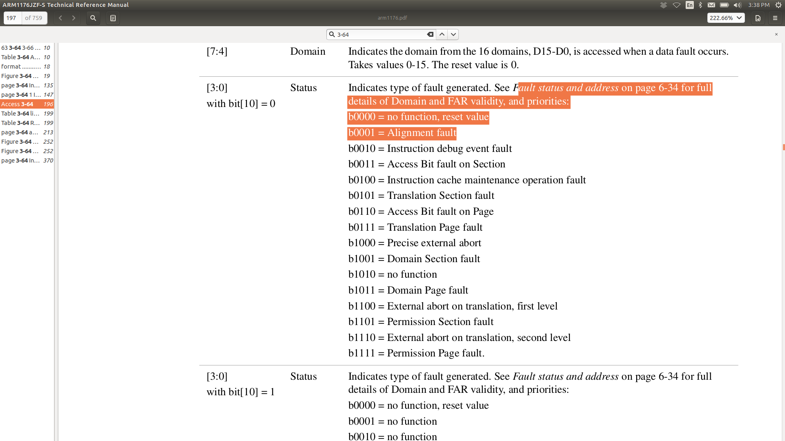
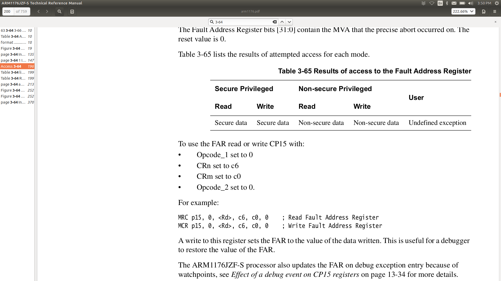

## Breakpoints

Do the readings in the [PRELAB.md](./PRELAB.md) first!

The ARM chip we use, like many machines, has a way to set both
*breakpoints*, which cause a fault when the progam counter is set to
a specific address, and *watchpoints* which cause a fault when a load
or store is performed for a specific address.  These are usually used
by debuggers to run a debugged program at full-speed until a specific
location is read, written or executed.

This lab will use watchpoints as a way to detect memory corruption
efficiently.  As you know too-well by now, challenge of bare-metal
programming is that we have not had protection against memory corruption.
By this point in the quarter, I believe everyone in the class has had
to waste a bunch of time figuring out what was causing memory corruption
of some location in their program.  After today's lab you should be able
to detect such corruption quickly:

   1. Simply set a watchpoint on the address of the memory getting corrupted,
   2. When a load or store to this address occurs, you'll immediately
      get an exception, at which point you can print out the program
      counter value causing the problem (or if you're fancy, a backtrace)
      along with any other information you would find useful.

Yes, we can do memory protection with virtual memory, but that also
requires a lot of machinery and can easily make real-time guarantees
tricky.  ARM virtual memory also only provides page-level protection,
whereas the watchpoints can track a single word (or even byte).

The lab today should be around 100-200 lines of code, doesn't need
virtual memory, and if you continue to do OS or embedded stuff, will be
very useful in the future.

### Background

A short cheat sheet of the assembly code to get various of the fault registers:
<table><tr><td>

</td></tr></table>

-----------------------------------------------------------------------------
### Part 0:  Get the debug id register

As a warmup, implement a routine to get the debug id register (page 13-6)
and use this to determine how many watchpoint and breakpoints our specific
ARM processor provides.

-----------------------------------------------------------------------------
### Part 1:  Catch loads and stores of `NULL`.

So far we've been vulnerable to load and stores of NULL (address 0).
If you run this code it will execute "successfully":

    #include "rpi.h"
    void notmain(void) {
        *(volatile unsigned *)0 = 0x12345678;
        printk("NULL = %x\n", *(volatile unsigned *)0);
    }

For this part:
  1. Set a watchpoint on address 0 using the `WVAR` (6-) and `WCTR` (6-)
  2. Implement the code in the `data_abort_int` handler to check if the
     exception is from a debug exception and, if so crash with an error.

How to get the data fault status register (DFSR, page 3-64): 
<table><tr><td>

</td></tr></table>

You can use the DFSR to get the cause of the fault from bits `0:3` if `bit[10]=0`:
<table><tr><td>

</td></tr></table>

After any modification to a co-processor 14 register, you have to do a 
`PrefetchFLush`:
<table><tr><td>

</td></tr></table>

How to get the fault address register (FAR): 
<table><tr><td>

</td></tr></table>

-----------------------------------------------------------------------------
### Part 2:  Catch jumps to `NULL`.

Now catch if we jump to `NULL` --- this will require setting a breakpoint
instead of a watchpoint and handling the exception in the `prefetch_int`
handler.

As above, differentiate that the exception was caused by a debug exception.

How to get the instruction fault status register (IFSR): 
<table><tr><td>

</td></tr></table>

-----------------------------------------------------------------------------
### Part 3: handle multiple watch and breakpoints.

In general, as a safety measure, we should probably always enable
watchpoint and breakpoints on `NULL`.   However, we'd also like to be
able to catch breakpoints on other addresses.

Extend your code to add support for a second simultaneous watchpoint and
breakpoint to a different address.  In the handler differentiate it if
it is a null pointer or a from the second value.

For this:
  1. Set a breakpoint on `foo` and see that you catch it.  
  2. Set a watchpoint on a value and see that you catch it.

-----------------------------------------------------------------------------
### Part 4: Single-stepping.

In many tools, we'd want to run a single instruction and then get control
back for a tool.

In the simplistic memory checker we built, we had the problem that it was
tricky to figure out where an instuction would wind up if if we executed a
single instruction.  Even an `add` instruction can jump somewhere else,
if it modifies the program counter `r15`.  We could handle this (the CPU
certainly does), but there are enough ARM instructions that it becomes
more and more tricky.

-----------------------------------------------------------------------------
### Extension: a more general breakpoint setup.

We hard-coded the breakpoint numbers and watchpoints to keep things simple.
You'd probably want a less architecture-specific method.  One approach
is to allocate breakpoints/watchpoints until there are no more available.

    // returns 1 if there were free breakpoints and it could set.
    // 0 otherwise. 
    int bkpt_set(uint32_t addr);
    // delete <addr>: error if wasn't already set.
    void bkpt_delete(uint32_t addr);

    // same: for watchpoints.
    int watchpt_set(uint32_t addr);
    int watchpt_delete(uint32_t addr);

### Extension:  Failure-oblivious computing.

Possibly the most-unsound paper in all of systems research is Rinard
et al's "Failure-oblivious computing", which made buggy server programs
"work" by handling memory corruption as follows:
   1. Discard out of bound writes.
   2. Return a random value for out of bound reads (starting at 0, 1, 2, ...).

We can only handle a single address, but we can do a similar thing.   Change
your exception code to take the complete set of registers, and restore from 
this set (so that you can change it).   

