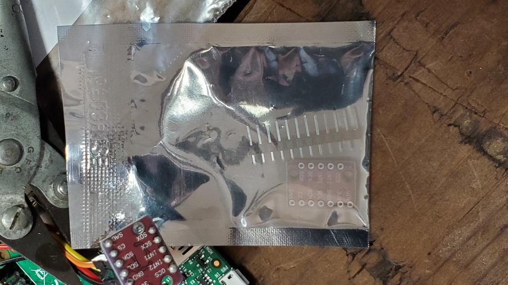
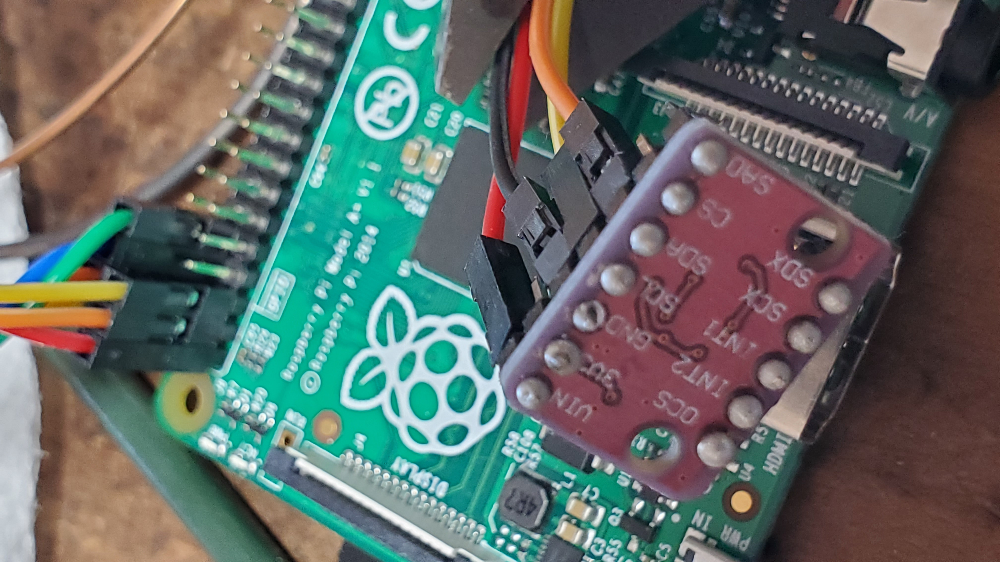

The main thing for the accelerometer:
   1. Solder the pins in.   Brian posted a soldering link if you need it.  
      The easiest way to do this is to push the pins in the breadboard,
      put your device on it, make sure it's somewhat level and then solder.
      Try not to overheat it!  

   2. Hook it up.  Make sure you use your 3v power for `Vin`.  You'll want to 
      hook up the SCL and SDA pins for i2c.  (Refer the the GPIO pin picture
      in the top level `docs/gpio.png`): SDA is the second GPIO pin on the 
      left of the pi pins, SCL is the third.  Both are right below the 
      3v power, which makes it easy.

   3. Make sure when you run `my-install test-programs/self-test.img` it
      runs and prints out something like the following --- the values should
      change as you move the acceleometer around:

The accelerometer should be in a sealed package:
<table><tr><td>
  
</td></tr></table>

When soldered and wired up, it looks like:
<table><tr><td>
  
</td></tr></table>

I'm going to annotate these today, but for the moment, documents describing
the LSM6DS3 accelerometer we have:
  1. The datasheet: [docs/LSM6DS33.pdf](./docs/LSM6DS33.pdf).
  2. An "application note" that is a bit more chatty: 
     [docs/LSM6DS33-AN4682.pdf](./docs/LSM6DS33-AN4682.pdf).
  3. A pdf of the actual [ebay-listing.pdf](./docs/ebay-listing.pdf) that
     we got these from.
