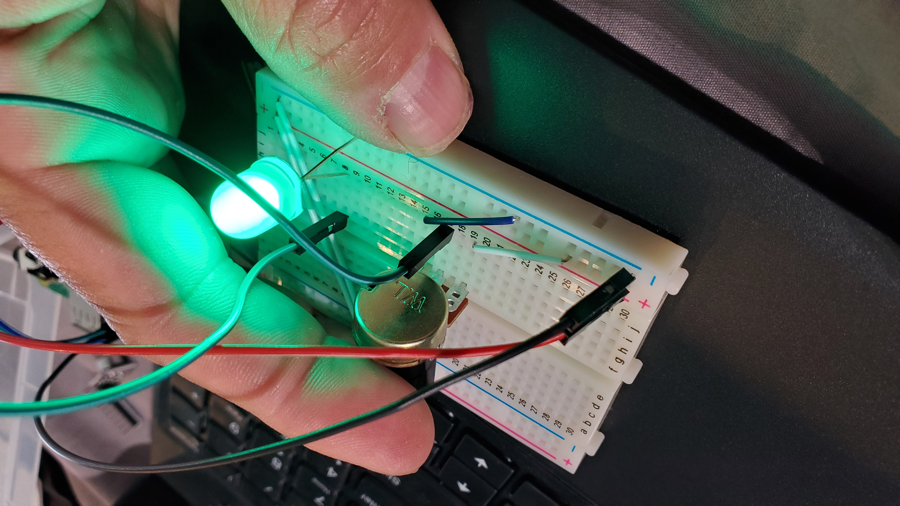
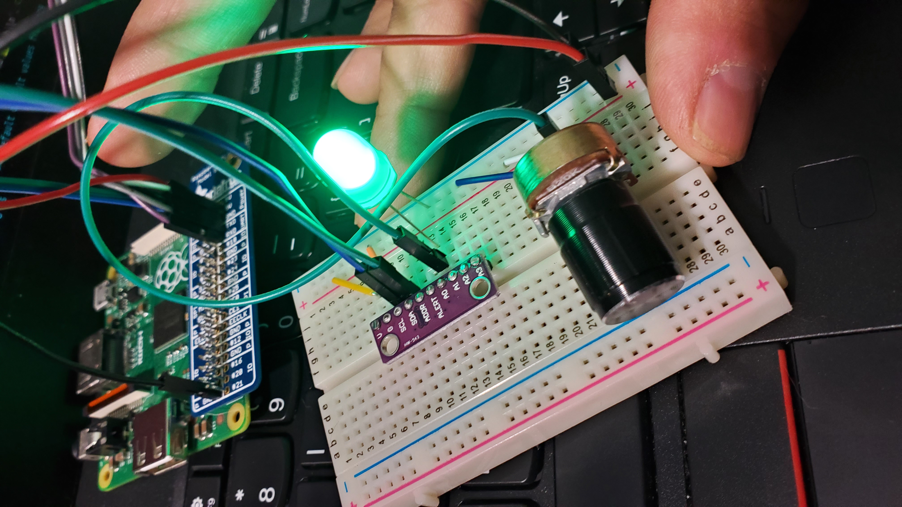

## Writing the i2c driver.

*** Make sure you do the [PRELAB](PRELAB.md)! ***

Today you're going to write your own I2C driver.  You definitely need to have done
the readings: 
   1. I2C in the broadcom document.
   2. The `ads1114.annotated.pdf` in the `./docs` directory.

You're going to do two things:
  1. Write a quick driver for the `ads1115` analog-to-digital converter.
     This will give us a way to get a known signal and see that you 
     are correct.

  2. Write the i2c code to drop replace our `i2c.o`.

  3. Hopefully do a high-level cross-check of your result against everyone else.
     (I'm still writing this.)

---------------------------------------------------------------------------
### Part0: hook up your potentiometer and ADC.

First off to make sure your basic hardware is working, use the breadboard
to hook up the potentiometer I sent out (the little knob) to the power
and ground from the pi and a middle leg controlling an LED.  The LED
should go bright and low as you turn the knob.  You'll keep this setup
even when you're using the ADC so that you can quickly check visually that
the ADC readings make sense.

<table><tr><td>
  
</td></tr></table>

Next hook up your ADC to the breadboard as well, with:
  - `a0` connected to the middle of the potentiometer (and LED).
  - `g` to ground
  - `v` to 3v.

<table><tr><td>
  
</td></tr></table>

---------------------------------------------------------------------------
### Part 1: write the i2c driver for the adc

We want to known signal to check your i2c.  Using the i2c makes this 
relatively easy.  It also re-enforces that after awhile, datasheets
look very similar and they often aren't that bad.

This code will closely mirror your last lab.  To save time, the 
starter code has some (but not all) page numbers.  There's
an annotated datasheet in `./docs`.

For this part:
  1. Implement `adc_write16` and `adc_read16` to read and write the 
     16-bit registers on the ads1115 using `i2c_write` and `i2c_read`.
  2. Figure out how to set the configuration register to have 860 samples per
     second and a +/- 4v range.
  3. Make sure your readings make sense.

This shouldn't take that long.  And having an ADC is super useful ---
there's a huge number of cheap analogue sensors and devices you can
now use.

---------------------------------------------------------------------------
### Part 2: implement an i2c driver.

You can flip between our implementation and yours by modifying the `Makefile`.
The annotated broadcom has the information you'l need. 

Note:
  1. You'll have to set the pins 2  (`SDA`) and 3 (`SCL`) pins to be used
     for i2c using `gpio_set_function` and the information on page 98.
  2. You'll want to use `dev_barriers()` here.
  3. Use the flags in the i2c fields!  Make sure don't start sending
     when the i2c hardware is still busy or when there is no space on
     the fifo.  Make sure if you read there is data there.  Make sure
     you check if there are errors.

As a first step, do the structure layout so that the field fields pass the 
assertions.

Use the `get32_T` and `put32_T` macros as discussed in the prelab.
So your code will look something like:

    c_register c = get32_T(&i2c->control);
        c.clear = 0b11; // shouldn't need, but hygenic(?)
        c.st = 1;
        c.read = read_p;
    put32_T(i2c->control, c);

`i2c_init`:
    1. Setup the pins
    2. Enable the i2c device.
    3. Reset the `done` flag and any errors.
    4. At the end: Assert anything useful.  For example, that a transfer is not active.

On both `i2c_read` and `i2c_write` make sure you start by reseting the 
`done` flag and clearing any errors.
   
---------------------------------------------------------------------------
### Exension: hook your light strip up to the microphone output.

I sent a simple microphone out to everyone.  It's pretty easy to use the ADC
to hook it up to your light strip and  display the results.

I'll have a floating-point version of libpi checked in pretty soon.

